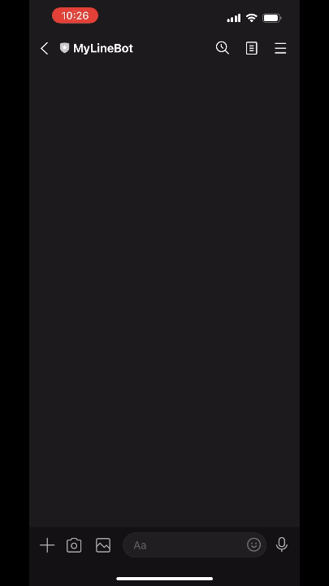
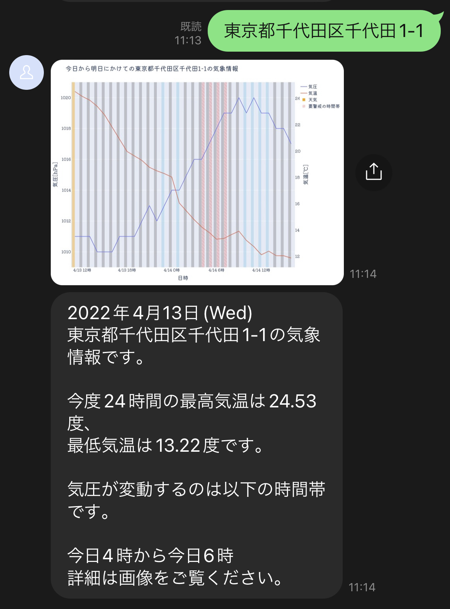
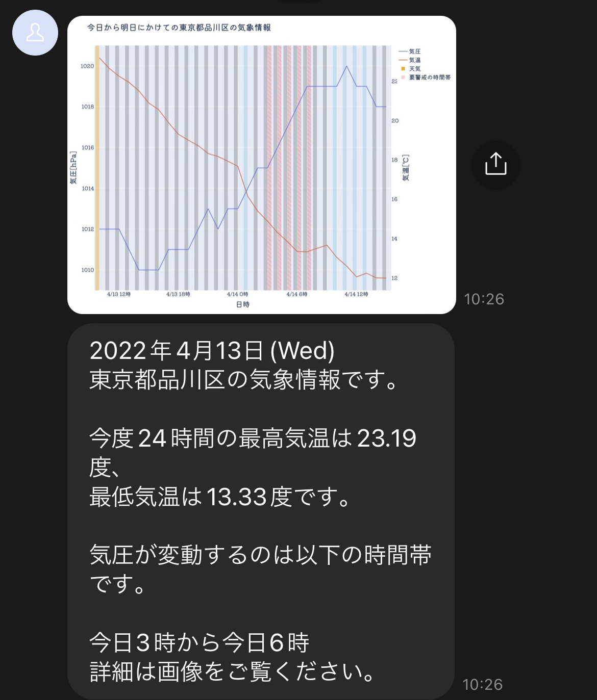

<h1 align="center">
  
   
   
  AtomosBot
  🌤
</h1>

<h4 align="center">
  その日の気象情報を毎朝LINEに通知したり、気になる都市や住所の天気をLINEのチャット1つですぐ確認したりできるLINE BOTです。
   
</h4>

  
  
  

<h6 align="center">
  その日の天気と気圧変動が一目で分かるグラフを描画します。
</h6>

  
   

# ⛈ Key Features

atomosbotの機能を紹介します。

### 今日一日の気象情報を毎朝通知

Herokuのスケジューラと連携することで、今日一日の気温や天気を毎朝LINEに通知できます。

### 気圧変動が要警戒の時間帯を可視化

気圧の乱高下から来る、体調の不調が起きやすい時間帯を赤斜線でハイライトし、文面上でも表示します。

### 入力した住所の気象情報も表示できます

Botとのトーク画面で任意の住所を打ち込むと、その場所の気象情報を返信します。

#### 例： 「東京都千代田区千代田1-1」と送信した場合

  
   

## 送信メッセージの詳細

  
   

### プロット部分

- 背景色 : 天気と気圧の要警戒時間帯を示します

  - 🌤 : オレンジ色
  - ☁️ : 灰色
  - ☔️ : 水色
  - 気圧の要警戒時間帯 : 赤斜線

- 折れ線グラフ（赤）: 1時間ごとの気温の変化
- 折れ線グラフ（青）: 1時間ごとの気圧の変化

###### Tips: 気象情報の取得先にしているOpenWeatherAPIの特徴として、少しでも雲が出そうだと晴れではなく曇りとする傾向があります

### テキスト部分

- 日付
- 表示対象のアドレス
- 今後24時間の最高・最低気温
- 気圧変動が大きい時間帯
