<h1 align="center">
  
  <br>
  <br>
  AtomosBot
  🌤
</h1>

<h4 align="center">
  その日の気象情報を毎朝LINEに通知したり、気になる都市や住所の天気をLINEのチャット1つですぐ確認したりできるLINE BOTです。
  <br>
</h4>

<p>
  
  <a href="https://opensource.org/licenses/MIT" target="_blank">
    
  </a>
  <a href="https://twitter.com/KoheiOhno3" target="_blank">
    
  </a>
</p>

<h6 align="center">
  その日の天気と気圧変動が一目で分かるグラフを描画します。
</h6>

<p align="center">
  
  <br>
</p>

# ⛈ Key Features

atomosbotの機能を紹介します。

### 今日一日の気象情報を毎朝通知

Herokuのスケジューラと連携することで、今日一日の気温や天気を毎朝LINEに通知できます。

### 気圧変動が要警戒の時間帯を可視化

気圧の乱高下から来る、体調の不調が起きやすい時間帯を赤斜線でハイライトし、文面上でも表示します。

### 入力した住所の気象情報も表示できます

Botとのトーク画面で任意の住所を打ち込むと、その場所の気象情報を返信します。

###### （注意：この機能はベータ版です。返信が少しおかしくなることもあります）

#### 例： 「東京都千代田区千代田1-1」と送信した場合

<p align="center">
  
  <br>
</p>

## 送信メッセージの詳細

<p align="center">
  
  <br>
</p>

### プロット部分

- 背景色 : 天気と気圧の要警戒時間帯を示します

  - 🌤 : オレンジ色
  - ☁️ : 灰色
  - ☔️ : 水色
  - 気圧の要警戒時間帯 : 赤斜線

- 折れ線グラフ（赤）: 1時間ごとの気温の変化
- 折れ線グラフ（青）: 1時間ごとの気圧の変化

###### Tips: 気象情報の取得先にしているOpenWeatherAPIの特徴として、少しでも雲が出そうだと晴れではなく曇りとする傾向があります

### テキスト部分

- 日付
- 表示対象のアドレス
- 今後24時間の最高・最低気温
- 気圧変動が大きい時間帯

# 🌦 How To Use

利用までに必要な手順は主に5つです。

1. LINE Messaging APIの設定
2. OpenWeather APIキーを取得
3. Gyazo APIキーを取得
4. このリポジトリをFork
5. Herokuの設定を行ってBotをデプロイ

## 1. LINE Messaging APIのトークンを取得

LINEの公式アカウントとして、自分にメッセージを送るためのBotを作成します。公式というと何か大変なものを想像しますが、無償の個人利用も可能です。

まず、[こちら](https://account.line.biz/login?)にアクセスし、ご自分のLINEアカウントでログインします。（普段使用しているものでOKです）

<p align="center">
  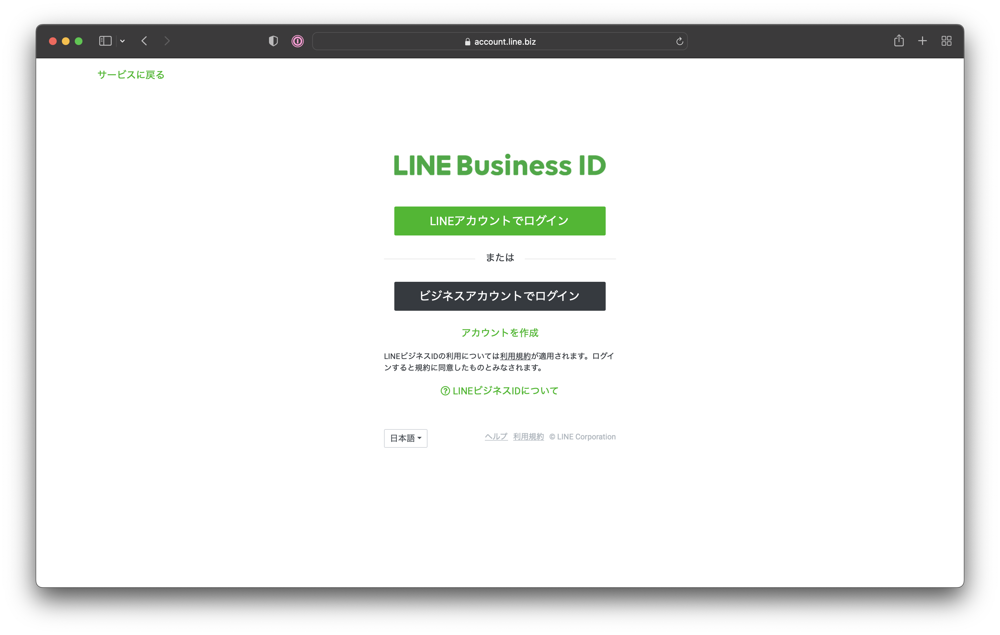
  <br>
</p>

このような画面になったら、Providersの横にある**Create**をクリックし、プロバイダーを作成します。名前は適当でOKです（自分は名前を入れました）。

<p align="center">
  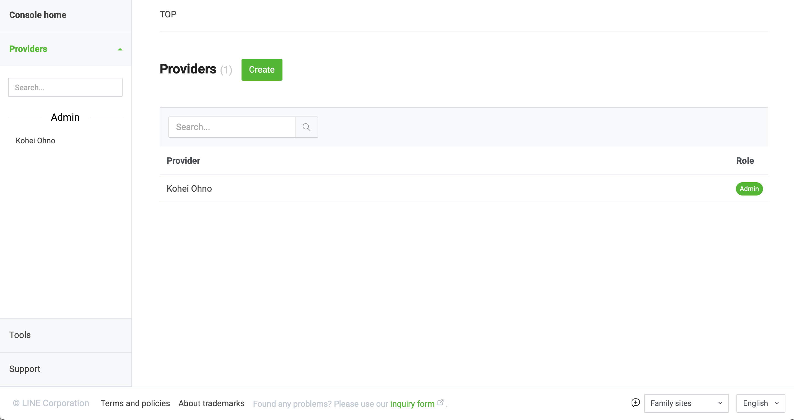
  <br>
</p>

一覧から作成したプロバイダーを選択すると、以下のような画面になるので、**Create a new Channel**をクリックし、チャンネルタイプは**Messaging API**を選びます。

<p align="center">
  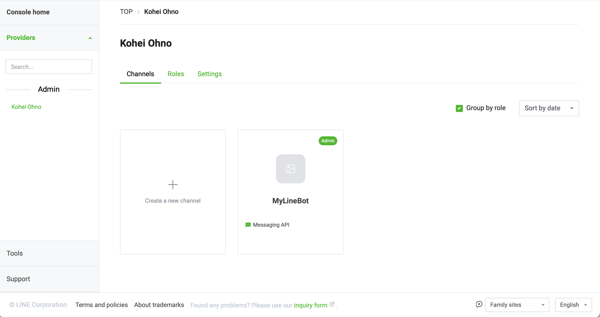
  <br>
</p>

<p align="center">
  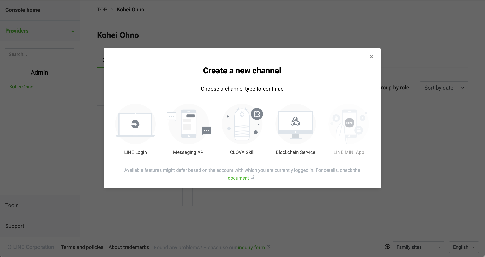
  <br>
</p>

するとチャンネルの詳細を設定する画面になるので、必要事項を入力します。

<p align="center">
  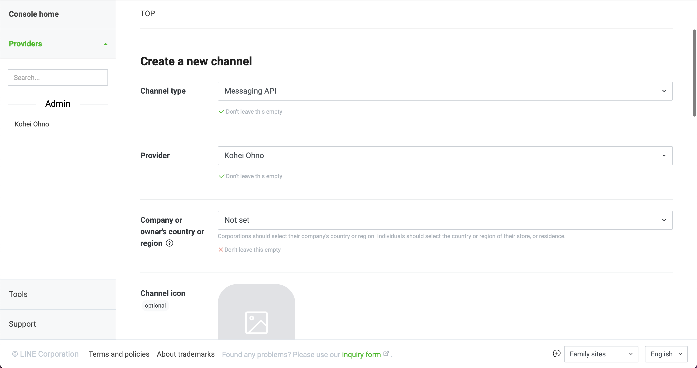
  <br>
</p>

チャンネルの作成が完了したら、設定画面に遷移します。

<p align="center">
  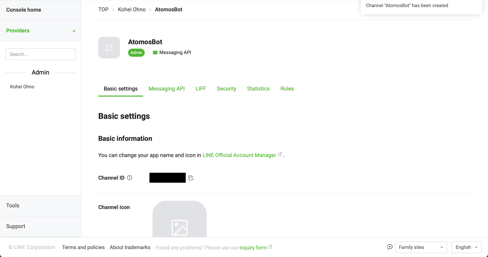
  <br>
</p>

このページに表示されているもののうち、必要なものが3つあるので、控えておきましょう。

#### 1. Basic settings > Your user ID *1

#### 2. Basic settings > Channel secret

#### 3. Messaging API > Messaging API settings > Channel access token *2

###### *1 : User IDがなくとも会話形式のBotは成り立ちますが、Botからの自発的なメッセージ送信は行えません

###### *2 : こちらは新しくIssueする必要があります

これでLINE側の設定は一旦終わりです（Herokuの設定後に一瞬だけ戻ってきます）。

## 2. OpenWeather APIキーを取得

[OpenWeathermap.org](OpenWeathermap.org)という、過去から現在に渡って世界中の気象情報を収集・提供し、天気予報も行っているというイギリスのすごいサイトから気象情報を取得します。

<p align="center">
  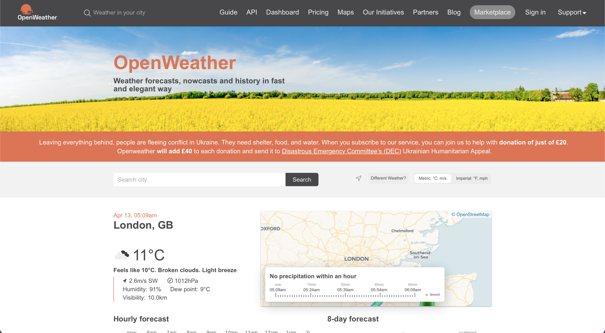
  <br>
</p>

まず、[こちら](https://home.openweathermap.org/users/sign_in)にアクセスし、アカウントを作成します。
既にアカウントがある場合はスキップしてください。

<p align="center">
  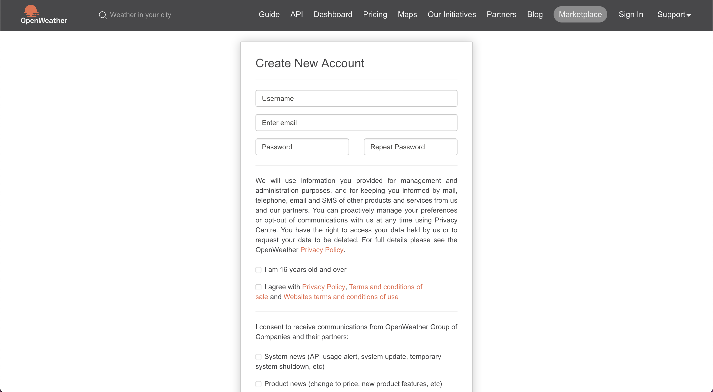
  <br>
</p>

アカウントの作成が完了したら、上のバー右上のユーザー項目から**My API Keys**を選択します。

ページ右側の**Create key**項目でAPI key name（なんでもいいです。画面ではatomosbotとしました）を入力し、**Generate**をクリックするとAPIキーを作成できます。

<p align="center">
  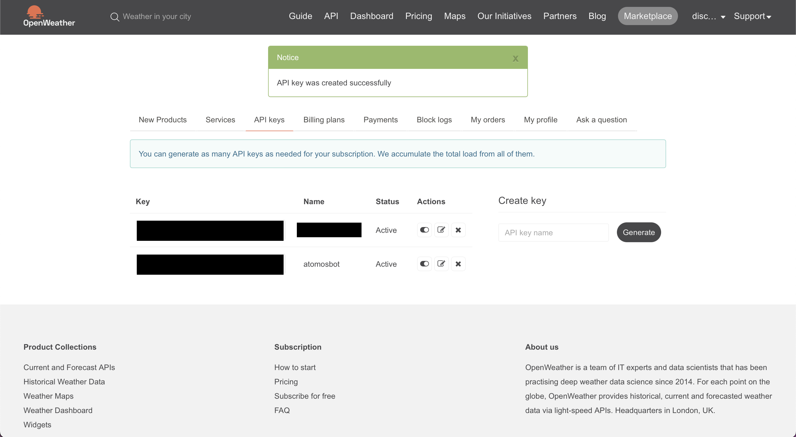
  <br>
</p>

ここで**Key**の部分にある文字列を使用するので、これも控えておきます。
これでOpenWeather APIキー取得は完了です。

## 3. Gyazo APIキーを取得

プロットの保存先としてGyazoを使用するので、GyazoのAPIキーを作成します。

しかし、こちらはOpenWeather APIキー取得と方法がさほど変わりないため、手順の説明は他サイト様にお任せします。

こちらのAPIキーも後々のために控えておきましょう。

#### 参考サイト

Gyazoのアクセストークンを取得する方法
[https://blog.naichilab.com/entry/gyazo-access-token](https://blog.naichilab.com/entry/gyazo-access-token)

## 4. このリポジトリをFork

GithubのリポジトリをHerokuと連携する際、自身のリポジトリとしてこのリポジトリを持っておく必要があるため、Forkを行います。

まず、Githubにログインしている状態で[こちら](https://github.com/discus0434/atomosbot)にアクセスし、右上の**Fork**をクリックします。

<p align="center">
  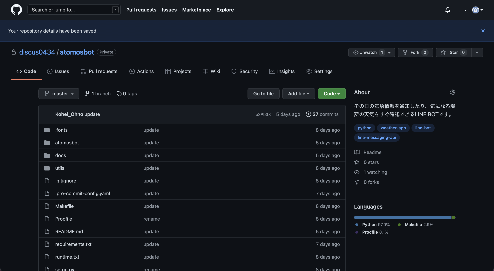
  <br>
</p>

**Create fork**をクリックします。

<p align="center">
  
  <br>
</p>

すると、自身をownerとしてコピーしたリポジトリを作成できます *1。

これでGithub上の準備は完了です。

###### *1 : なお、このリポジトリはMIT License です

###### * MIT License : コピーしての利用・配布・変更・変更後の再配布・商用利用・有料販売等全てご自由に行えますが、ソースコードか、ソースコードに同梱したライセンス表示用の別ファイルにて、このソフトウェアの著作権表示(**Copyright (c) 2022 Kohei Ohno**)とライセンスの全文掲載が必要です。また、このソフトウェアの利用による問題が起きた場合に、製作者は一切の責任を負いません

## 5. Herokuの設定を行い、このリポジトリをデプロイ

Herokuとは、こちらが動かしたいアプリケーションをクラウド上でデプロイ（実行・運用）してくれるPaaS（Platform as a Service）です。

アカウントを持っていない方は、まず[こちら](https://signup.heroku.com/login)にアクセスしてアカウントを作成します。

<p align="center">
  
  <br>
</p>

### HerokuにGithubのリポジトリをデプロイさせる

登録ばかりでだいぶ面倒になってきた頃合いだと思いますが、このステップが最後です。

アカウントの作成が完了したら、ダッシュボードが表示されるので、右上の**New**から**Create New App**を選択します。

遷移した画面では、新しいアプリの名前とリージョンを入力します。ここも名前は適当でOKです。リージョンは残念ながら日本が存在しないため、「United States」で進めます *1。

###### *1 : リージョンの違いによって起きる不具合は後ほど設定から対処します

<p align="center">
  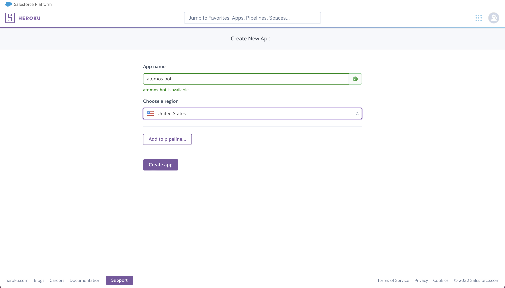
  <br>
</p>

アプリを作成したら、**Deploy > Deployment Method**からGithubを選択し、HerokuとGithubを連携します。

<p align="center">
  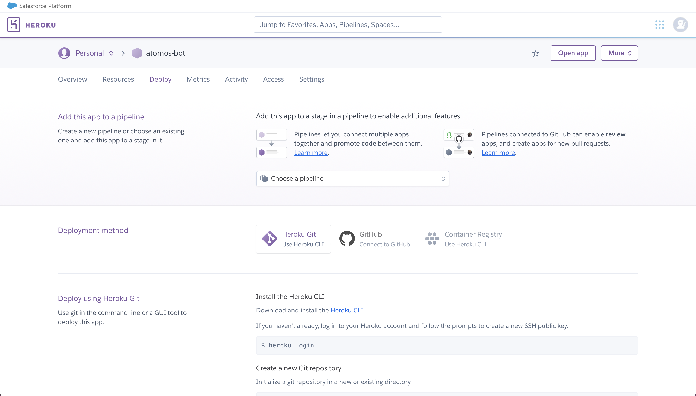
  <br>
</p>

そして、自分のリポジトリから先ほどフォークしたものを選び、**Connect**をクリックします。

<p align="center">
  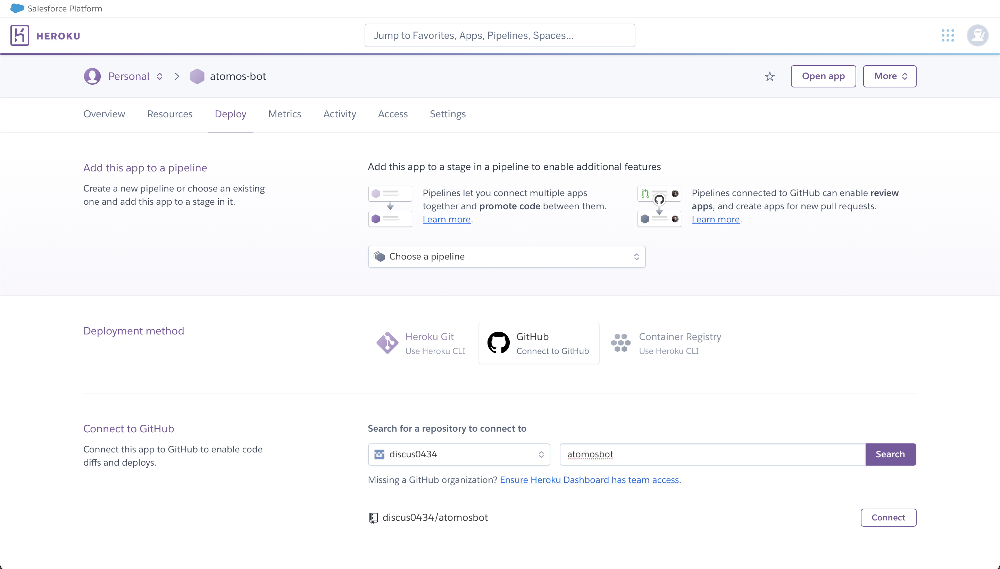
  <br>
</p>

**Connect**が完了したら、**Automatic deploys**の**Enable Automatic Deploys**をクリックして自動デプロイを有効にしておきましょう。

<p align="center">
  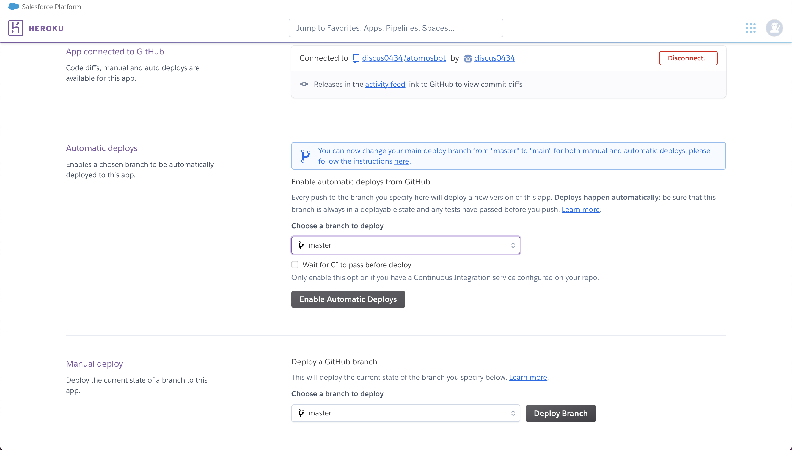
  <br>
</p>

この設定によって、forkした自身のリポジトリのmasterブランチに変更があった際、自動で変更したものをデプロイしてくれます。

### Herokuでデプロイする

次は、Herokuの環境変数の設定です。ダッシュボードの**Settings**から**Config Vars > Reveal Config Vars**を選択します。

<p align="center">
  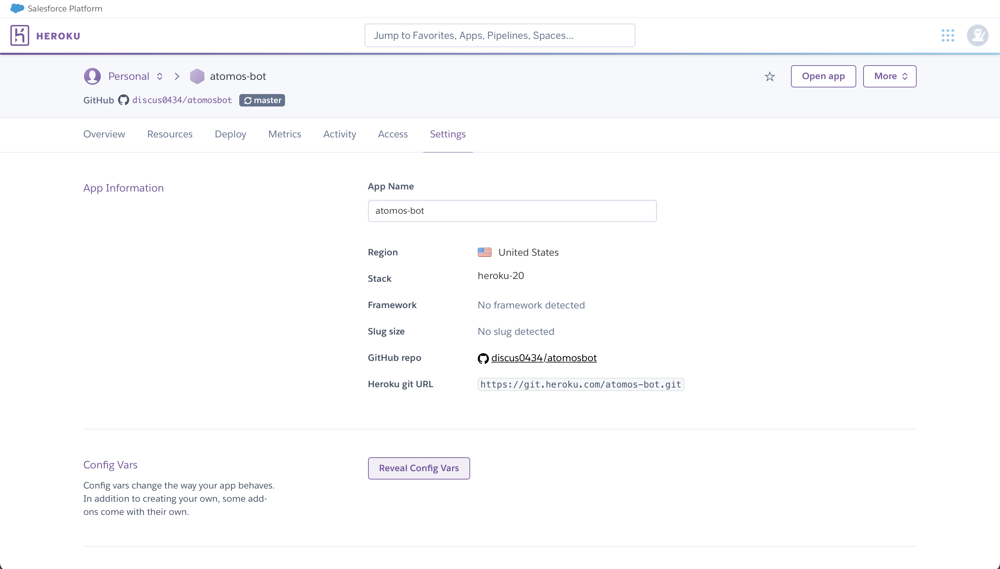
  <br>
</p>

すると、このようなKey-Valueペアの入力画面が出てくるので、以下のように入力してください。

| KEY                  | VALUE                   |
|:---------------------|:------------------------|
| CHANNEL_ACCESS_TOKEN | <LINEのAccess Token>    |
| CHANNEL_SECRET       | <LINEのSecret Key>      |
| USER_ID              | <LINEのUser ID>         |
| OPENWEATHER_API_KEY  | <OpenWeatherのAPI Key>  |
| GYAZO_API_KEY        | <GyazoのAPI Key>        |
| TZ                   | Asia/Tokyo              |
| LANG                 | ja_JP.UTF-8             |

これで、Herokuがこのアプリケーションをデプロイする際、必要に応じてGyazoだったりOpenWeatherのサービスを利用してくれます。

また、タイムゾーンと言語を日本のものに設定することで、アプリケーションのデプロイを行っているリージョンが米国になっていることから起きる不具合を解消します。

続けて、すぐ下の**Buildpacks**からアプリケーションをデプロイするときのパッケージを設定します。

コードはpythonで書いているので、**python**を選択します。

<p align="center">
  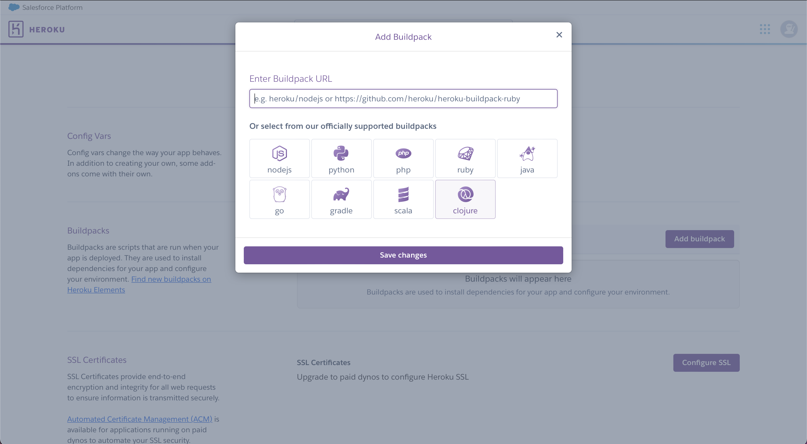
  <br>
</p>

すると、次のデプロイのときにこのビルドパックを使用すると言われるので、手動でデプロイしてしまいましょう。

**Deploy > Manual deploy**を選択し、masterブランチを**Deploy Branch**でデプロイします。

すると、リポジトリ内のファイルで設定した要求環境のビルドが勝手に進行し、デプロイしてくれます。

<p align="center">
  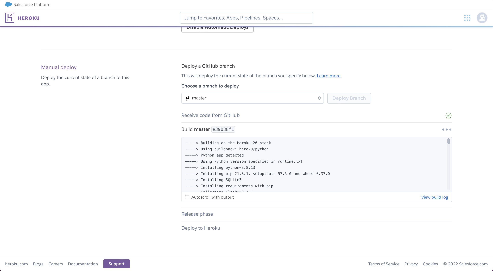
  <br>
</p>

### Herokuにスケジューラを導入

毎日決まった時間にBotから気象情報を通知してもらうために、Heroku SchedulerをHerokuのアプリケーションに導入します。

まず、Herokuにログインしている状態で、[こちら](https://elements.heroku.com/addons/scheduler)にアクセスし、右上の**Install Heroku Scheduler**をクリックします。

<p align="center">
  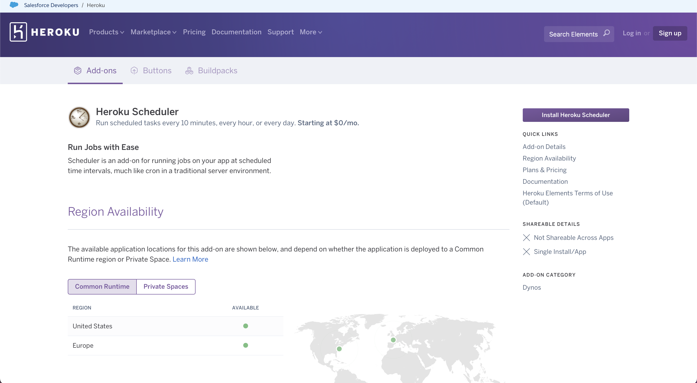
  <br>
</p>

そして、**App to provision to**から自身のアプリケーションを選択し、**Submit Order Form**で導入します。

<p align="center">
  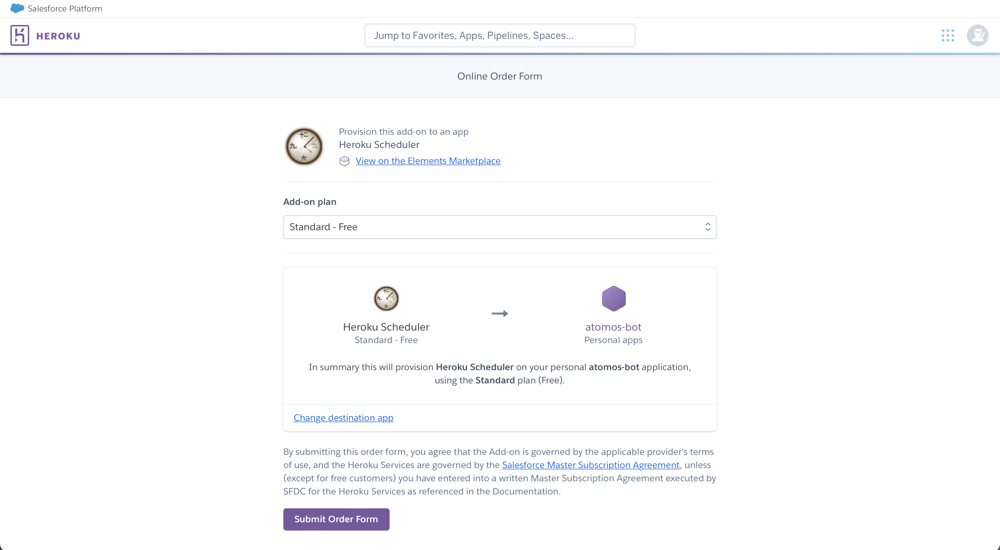
  <br>
</p>

導入したらHeroku Scheduler自体の設定画面を開き、**Create job**からスケジュールと実行するコマンドを入力します。

<p align="center">
  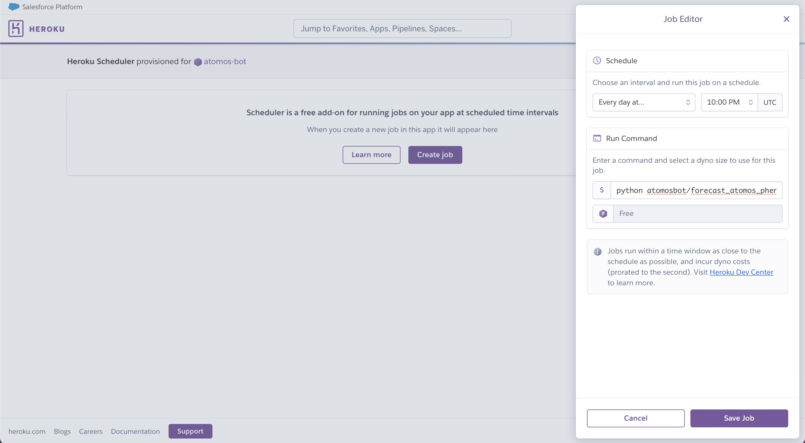
  <br>
</p>

ここで注意すべきなのが、時刻の表示がUTCになっているため、日本標準時とは異なります。毎日AM7:00に通知してもらいたい場合は、

**Every day at...** + **10:00 PM** と設定します。

また、定期実行するコマンドは以下に設定します。

```zsh
python atomosbot/forecast_atomos_phenom.py
```

設定が終わったら、**Save Job**で定期実行の設定を保存します。

### LINE Messanging APIとHerokuを連携

あとちょっとです。次にLINEの方に戻り、アプリの設定のうち**Messaging API > Webhook settings**から**Webhook URL**を指定します。

<p align="center">
  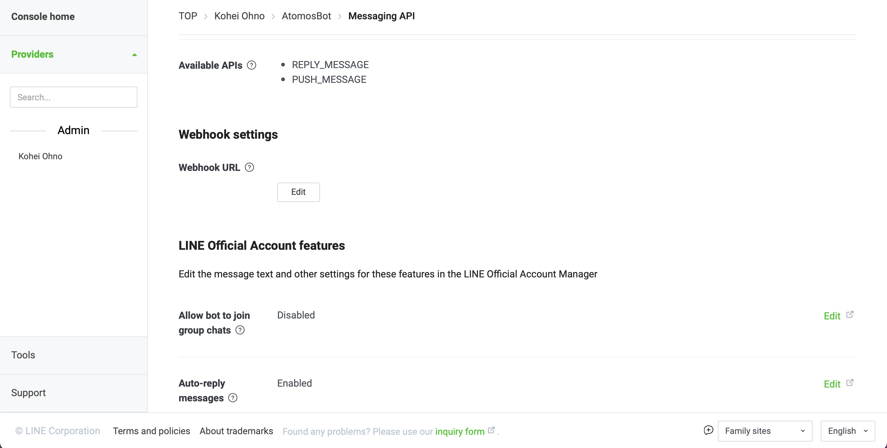
  <br>
</p>

Webhook URLは以下のものを入力してください。

> https:// <herokuで設定したアプリ名> .herokuapp.com/callback


連携がうまくいくと、**Success**と表示されます。

<p align="center">
  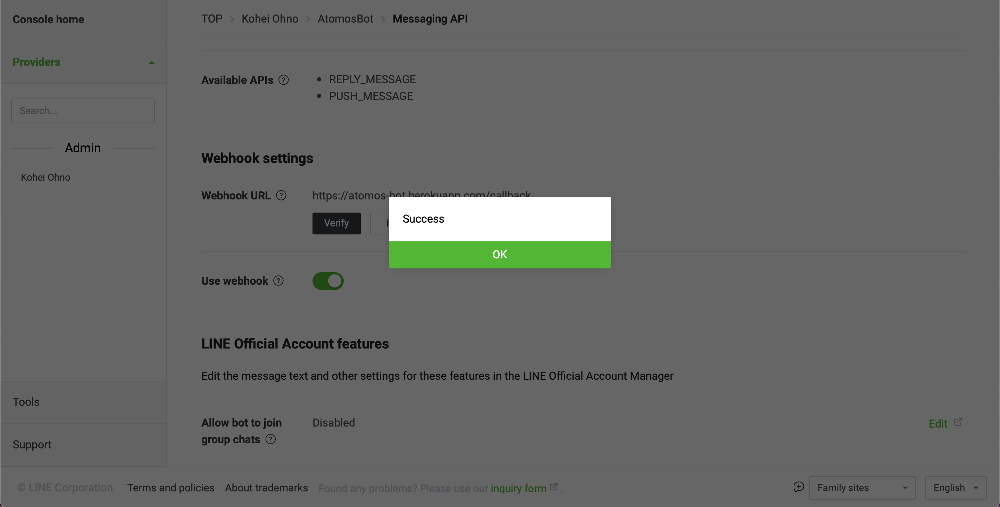
  <br>
</p>

---

これで設定終了です。お疲れ様でした！

## Run Tests

LINEの設定画面から、

**Messaging API > QR code**にあるQRコードをお手元のスマホのLINEから読み込み、友だち追加します。

<p align="center">
  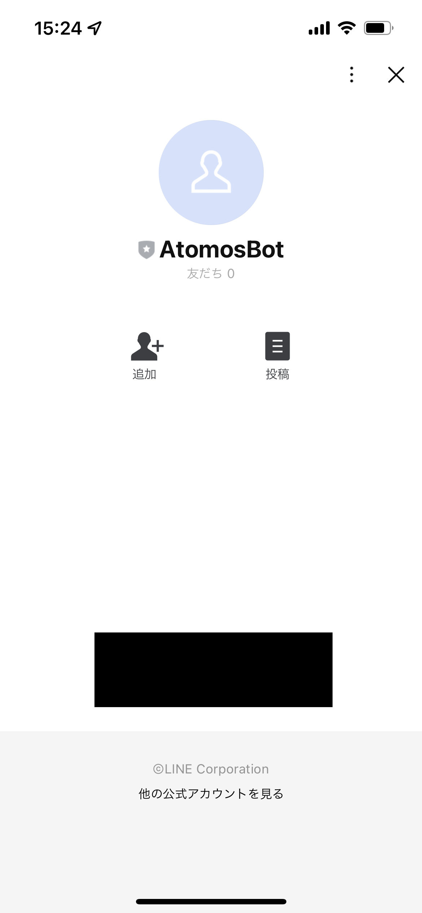
  <br>
</p>

そのままトークを開きます。このよく見る友だち追加文が、デフォルトのものだったという必要のないトリビアが得られます。

<p align="center">
  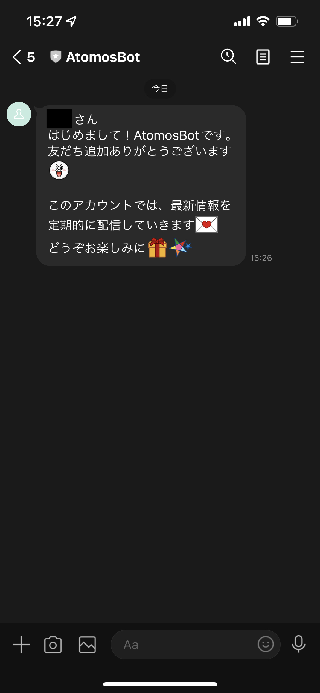
  <br>
</p>

この状態で、Herokuのダッシュボードを開き、右上にある**More**から**Run console**を選択し、以下のコマンドを実行してみましょう。

```zsh
python atomosbot/forecast_atomos_phenom.py
```

設定がうまくいった場合、このようにメッセージが送られてきます！

<p align="center">
  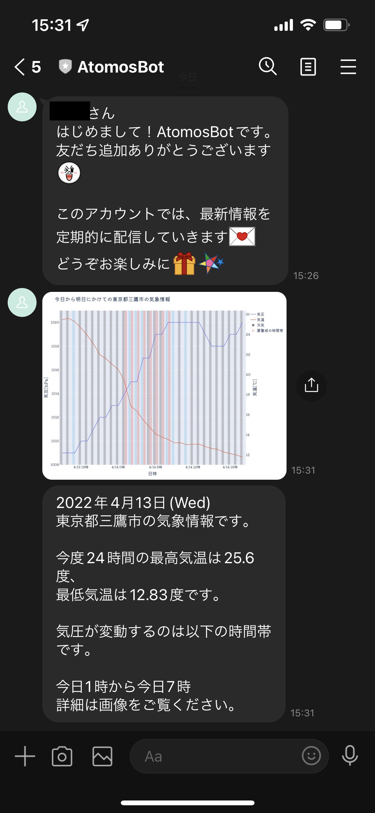
  <br>
</p>

# ⚡️ Description

TODO: 説明を入力

# ☔️ Author

👤 **Kohei Ohno**

- Website: <https://www.wantedly.com/id/kohei__ohno>
- Twitter: [@KoheiOhno3](https://twitter.com/KoheiOhno3)
- Github: [@discus0434](https://github.com/discus0434)

# 📝 License

Copyright © 2022 [Kohei Ohno](https://github.com/discus0434).<br />
This project is [MIT](https://opensource.org/licenses/MIT) licensed.

---
_This README was generated with ❤️ by [readme-md-generator](https://github.com/kefranabg/readme-md-generator)_
