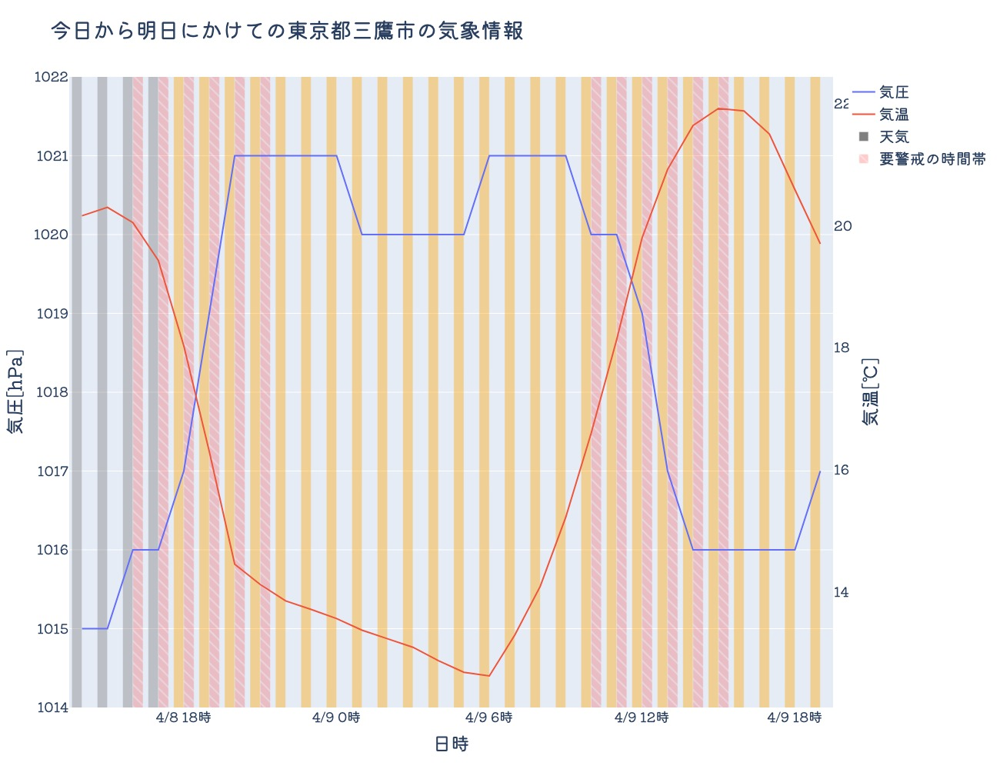

<h1 align="center">
  
  <br>
  <br>
  AtomosBot
  🌤
</h1>

<h4 align="center">
  その日の気象情報を毎朝LINEに通知したり、気になる都市や住所の天気をLINEのチャット1つですぐ確認したりできるLINE BOTです。
  <br>
</h4>

<p>
  
  <a href="https://opensource.org/licenses/MIT" target="_blank">
    
  </a>
  <a href="https://twitter.com/KoheiOhno3" target="_blank">
    
  </a>
</p>

<h6 align="center">
  その日の天気と気圧変動が一目で分かるグラフを描画してくれます。
</h6>

###### TODO: 画像が分かりにくいので後々差し替える

<p align="center">
  
  <br>
</p>

# ⛈ Key Features

# 🌦 How To Use

## Run Tests

```sh
heroku run python atomosbot/forecast_atomos_phenom.py
```

# ⚡️ Description

# 🌈 Reference

# ☔️ Author

👤 **Kohei Ohno**

* Website: <https://www.wantedly.com/id/kohei__ohno>
* Twitter: [@KoheiOhno3](https://twitter.com/KoheiOhno3)
* Github: [@discus0434](https://github.com/discus0434)

# 📝 License

Copyright © 2022 [Kohei Ohno](https://github.com/discus0434).<br />
This project is [MIT](https://opensource.org/licenses/MIT) licensed.

***
_This README was generated with ❤️ by [readme-md-generator](https://github.com/kefranabg/readme-md-generator)_
